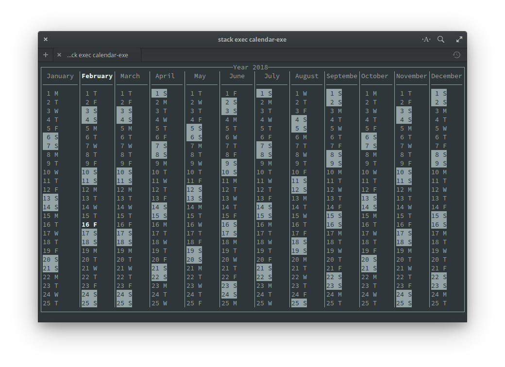

# Calendar
This program was made while playing with the [brick library](https://github.com/jtdaugherty/brick/blob/master/README.md).

Currently, it displays a calendar of the current year in the terminal, highlighting the current month and day.

